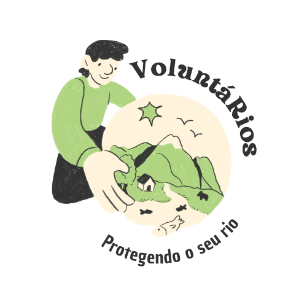

# VoluntaRios 🌊🌿



## 📖 Sobre o Projeto

O **VoluntaRios** é um aplicativo inovador projetado para conectar voluntários a iniciativas de preservação ambiental ao longo do Rio Itajaí-Açu, em Santa Catarina, Brasil. Com o objetivo de promover o engajamento comunitário e aumentar a conscientização sobre a importância da conservação dos recursos hídricos, o VoluntaRios permite que os usuários se cadastrem, se conectem com projetos de voluntariado e participem ativamente da proteção do meio ambiente.

## 🎯 Objetivos do Projeto

- **Conectar Voluntários**: Facilitar a conexão entre voluntários e projetos ambientais locais.
- **Conscientização**: Promover a conscientização sobre a preservação dos rios e da biodiversidade.
- **Engajamento**: Criar um senso de comunidade entre os usuários e as iniciativas de preservação.

## 🛠️ Funcionalidades Implementadas

O projeto conta com as seguintes funcionalidades e principais telas:

- **Tela de Home**: Contém as informações do que seria o projeto VoluntáRios com as opções de fazer Login os se cadastrar
- **Tela de Login**: Permite que os usuários se autentiquem usando e-mail e senha.
- **Tela Principal**: Essa tela mostra as informações dos eventos que acontecem todas as semanas, tem um link da defesa Civil para saber mais informações de qual a situação atual do Rio.
- **Tela de Ajuda**: A tela de ajuda contém as perguntas frequentes e as formas de contato com algém responsávelpelos voluntários.
- **Tela de Registro**: Permite que novos usuários se cadastrem com informações essenciais como e-mail e senha.
- **Tela de Informações**: Nessa tela contém mais algumas informções do porque ser um voluntário e de como proceguir.
- **Telas de preencher dados**: Nessas telas o voluntário preenche mais alguns dados sobre seu Nome completo, sua idade, suas preferências de trabalho, suas habilidades, etc...
- **Tela de Dados**: Nessa tela é mostrado os seus dado cadastrados e uma mensagem que seu cadastro foi um sucesso e que é só esperar alguém entrar em contato.
- **Navegação**: Transição suave entre as telas de login e registro.
- **Design Atraente**: Interface de usuário moderna com um design amigável e intuitivo.


## Rodar o projeto

1. **Clone o repositório**:

    ```bash
    git clone https://github.com/alinehoffmann123/ProjetoVoluntaRios.git
    ```
2. **Instale as dependências**:

    Navegue até o diretório do projeto:

    ```bash
    cd ProjetoVoluntaRios
    ```

    Rode o seguinte comando

    ```bash
     flutter doctor
    ```

    Em seguida, instale as dependências com o Flutter:

    ```bash
    flutter pub get
    ```

    Para instalar as dependências do Firebase rode o seguinte comando

    ```bash
    npm install -g firebase-tools
    ```

    Em seguida, configure o firebase e aceite todas as dependências

    ```bash
    flutterfire configure
    ```

    Agora para rodar o projeto, de o seguinte comando

    ```bash
    flutter run
    ```

    E escolha a opção 2 para rodar no chrome.

---

Obrigado por visitar o repositório do VoluntáRios! Junte-se a nós nessa jornada pela preservação do meio ambiente!

---

* Desenvolvido por Aline Fernada Hoffmann e Gabriela da Silva. *
